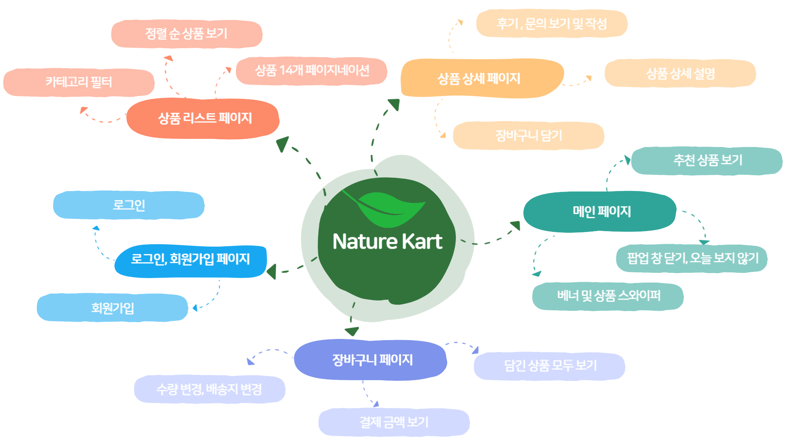

# 멋쟁이사자처럼 FrontEnd 12기 Vanilla Project

배포 URL : [바로가기](https://carly-tailwind.netlify.app/)

GITHUB 주소 : [바로가기](https://github.com/FRONTENDBOOTCAMP-12th/TailWind-MarketCarly)

WIKI 주소 : [바로가기](https://github.com/FRONTENDBOOTCAMP-12th/TailWind-MarketCarly/wiki)

테스트 계정
ID : littlestar58 / PW : likelion@123

## 목차

1. 조원
2. 프로젝트 소개
3. 프로젝트 안내
4. 페이지별 설명

## 조원

### 조원 소개

|       이름        |                   권태일                    |                 김나은                  |                   김지명                    |                       노종국                        |                이영범                 |
| :---------------: | :-----------------------------------------: | :-------------------------------------: | :-----------------------------------------: | :-------------------------------------------------: | :-----------------------------------: |
|       역할        |                    조장                     |                  조원                   |                    조원                     |                        조원                         |                 조원                  |
| 컴포넌트  분배 |                    모달                     |                  푸터                   |                    헤더                     |                      상품카드                       |          팝업 &  사이드바          |
|   개발  분배   |            상품 상세  페이지             |         로그인 &   회원가입          |           상품리스트   & 검색            |                      장바구니                       |              메인페이지               |
|      github       | [workerKwon](https://github.com/workerKwon) | [betteree](https://github.com/betteree) | [jimyeong21](https://github.com/jimyeong21) | [Littlestar0508](https://github.com/Littlestar0508) | [lyb9030](https://github.com/lyb9030) |

### 팀명

-   Vanilla Project 3조 태일윈드

### 프로젝트 내 목표

-   원활한 협업

    -   서로를 존중하는 태도로 커뮤니케이션에 임할 것
    -   적절한 소통과 의견조율을 통해 사이좋게 개발할 것

-   웹 접근성 준수

    -   차별없이 누구나 이용할 수 있는 웹 사이트를 구축할 것

-   유효한 기능 개발
    -   코드 품질 향상세 신경 쓸 것
    -   정상적으로 동작하는 기능을 구현할 것

## 프로젝트 소개

### 기간

2024.12.10 (MON) ~ 2025.01.03 (FRI) (약 26일)

-   2024.12.09 : 커밋 컨벤션, 코딩컨벤션 및 사용 기술에 대한 정리
-   2024.12.10 : 디자인 분석 및 공동 컴포넌트 파트 분배
-   2024.12.11 ~ 2024.12.12 : 개별 개발 진행 및 수시 Q&A 및 에러사항 회의
-   2024.12.13 : 상세 디자인 분석 및 개발 파트 분배
-   2024.12.16 ~ 2024.12.18 : 개별 개발 진행 및 수시 Q&A 및 에러사항 회의
-   2024.12.19 : 1차 배포 및 기능 점검
-   2024.12.20 : 중간 점검 진행
-   2024.12.23 ~ 2024.12.30 : 개별 개발 진행 및 수시 Q&A 및 에러사항 회의
-   2024.12.31 ~ 2025.01.02 : 2차 배포 및 웹 표준 및 웹 접근성 확인
-   2025.01.03 : 코드 최종 수정 및 최종 배포 진행

### 사용된 기술

   

    

### 시안

-   [마켓컬리 피그마 시안 바로가기](https://www.figma.com/file/Jm4FOBWLsQxsrZvn5LZOgI/마켓칼리?type=design&node-id=365%3A2825&mode=design&t=R5p9Zz4v0ZmFCJYa-1)

### 요구사항

-   슬라이드가 필요한 UI에서는 swiper.js를 사용해주세요.
-   localStorage를 사용하여 "최근 본 상품"의 UI를 구성해주세요.
-   "마이크로 애니메이션"이 필요하다면 추가해주세요.
-   "회원가입 기능"을 구현해주세요.
-   "이메일과 비밀번호의 유효성을 확인합니다.
-   회원가입을 통해 사용자(user)를 생성하고 관리합니다.
-   장바구니 기능을 구현해 주세요. 
    [요구사항 상세 바로가기](https://productive-printer-b81.notion.site/8da1841590ad4b05b28ec0d0d61dae42)

## 프로젝트 상세 설명

### 폴더 구조

📁 TAILWIND-MARKETCARLY

    📦src
     ┣ 📂Api
     ┣ 📂Components
     ┃ ┣ 📂AddCart
     ┃ ┣ 📂Badge
     ┃ ┣ 📂BannerMiddle
     ┃ ┣ 📂Birth
     ┃ ┣ 📂Bubble
     ┃ ┣ 📂Cart
     ┃ ┣ 📂CheckBox
     ┃ ┣ 📂Header
     ┃ ┣ 📂IncDecComponent
     ┃ ┣ 📂Input
     ┃ ┣ 📂Label
     ┃ ┣ 📂PopUp
     ┃ ┣ 📂ProductCard
     ┃ ┣ 📂ProductDetailModal
     ┃ ┣ 📂ProductHeader
     ┃ ┣ 📂ProductPagination
     ┃ ┣ 📂ProductSorting
     ┃ ┣ 📂ProductSwiper
     ┃ ┣ 📂Radio
     ┃ ┣ 📂RadioGroup
     ┃ ┣ 📂Search
     ┃ ┣ 📂SideBar
     ┃ ┣ 📂SideMenu
     ┃ ┣ 📂Spinner
     ┃ ┣ 📂AddCart
     ┃ ┗ 📂swiper
     ┣ 📂Layout
     ┃ ┣ 📂Footer
     ┃ ┗ 📂Header
     ┣ 📂Pages
     ┃ ┣ 📂Cart
     ┃ ┣ 📂Login
     ┃ ┣ 📂ProductDetail
     ┃ ┣ 📂ProductList
     ┃ ┣ 📂Register
     ┃ ┗ 📂SearchResult
     ┣ 📂Styles
     ┗ 📂Utils

### 주요 기능 구성

### 주요 기능 시현

| 제목         | 상세설명                                                                                                                                                              |
| ------------ | --------------------------------------------------------------------------------------------------------------------------------------------------------------------- |
| 주제         | [메인페이지-팝업창]()                                                                                                                                                 |
| 동작 화면    |                                                                                                                  |
| 기능 및 구현 | - 홈페이지 접속시 팝업창이 자동으로 노출   - 닫기를 누를 경우 팝업창이 정상적으로 닫아 짐   - 하루 안 보기를 누르면 홈페이지를 새로고침 해도 팝업이 나오지 않음 |

 

| 제목         | 상세설명                                                     |
| ------------ | ------------------------------------------------------------ |
| 주제         | [메인페이지-스와이퍼]()                                      |
| 동작 화면    |        |
| 기능 및 구현 | - 메인 배너 스와이퍼 작동   - 상품 카테고리 스와이퍼 작동 |

 

| 제목         | 상세설명                                                                          |
| ------------ | --------------------------------------------------------------------------------- |
| 주제         | [메인페이지-검색]()                                                               |
| 동작 화면    |                             |
| 기능 및 구현 | - 메인 검색창에서 제품 검색 가능   - 검색된 제품 클릭하여 상세페이지 접속 가능 |

 

| 제목         | 상세설명                                                                                                                                 |
| ------------ | ---------------------------------------------------------------------------------------------------------------------------------------- |
| 주제         | [상품페이지-정렬]()                                                                                                                      |
| 동작 화면    |                                                                                   |
| 기능 및 구현 | - 상품의 다음 페이지로 이동 가능   - 상단의 신상품순, 낮은가격순, 높은가격순 정렬 가능   - 카테고리 필터의 원하는 필터만 노출 가능 |

 

| 제목         | 상세설명                                                                                                                                  |
| ------------ | ----------------------------------------------------------------------------------------------------------------------------------------- |
| 주제         | [상품페이지-상세내역]()                                                                                                                   |
| 동작 화면    |                                                                                    |
| 기능 및 구현 | - 상품 갯수 변동에 따른 가격 변동기능   - 탭바를 클릭 할 경우 원하는 카테고리로 이동  - 로그인 하여야만 상품 후기 및 문의 작성 가능 |

 

| 제목         | 상세설명                                                                            |
| ------------ | ----------------------------------------------------------------------------------- |
| 주제         | [상품페이지-후기 및 문의사항]()                                                     |
| 동작 화면    |                                  |
| 기능 및 구현 | - 로그인 후 상품 후기 및 문의 작성 가능   - 문의글의 경우 비밀글로 작성 가능  |

 

| 제목         | 상세설명                                                     |
| ------------ | ------------------------------------------------------------ |
| 주제         | [로그인-성공결과창]()                                        |
| 동작 화면    |  |
| 기능 및 구현 | - 로그인 성공 후 메인페이지로 이동 결과                      |

 

| 제목         | 상세설명                                                                                                           |
| ------------ | ------------------------------------------------------------------------------------------------------------------ |
| 주제         | [로그인-실패창]()                                                                                                  |
| 동작 화면    |                                                         |
| 기능 및 구현 | - ID 및 PW 공란이거나 조건미달일 경우 경고문구 안내   - 존재하지 않는 ID 및 PW 오류로 로그인시 실패 경고문 안내 |

 

| 제목         | 상세설명                                                                                                      |
| ------------ | ------------------------------------------------------------------------------------------------------------- |
| 주제         | [장바구니-토탈]()                                                                                             |
| 동작 화면    |                                                   |
| 기능 및 구현 | - 장바구니 제품 삭제 및 수량 변경 기능   - 제품 삭제 및 수량 변경에 따른 상품 총 금액 및 결제예정금액 변동 |
